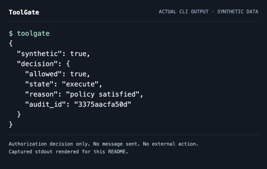
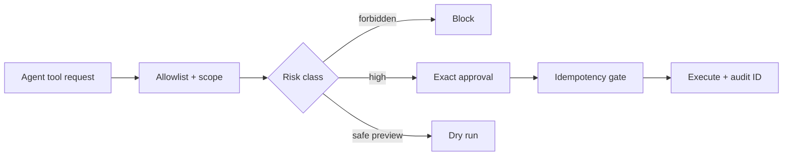

# ToolGate

**Permissioned agent tools with dry runs, approvals, and replay safety.**

> All people, organizations, records, measurements, and outcomes in this
> repository are synthetic.



## Run it locally

Requires Git and Python 3.12. Initial setup downloads dependencies; no model key is needed.

```bash
git clone https://github.com/Jermaine-Anugwom/toolgate.git
cd toolgate
python3.12 -m venv .venv
source .venv/bin/activate
python -m pip install -c constraints.txt -e '.[dev]'
toolgate
```

The CLI prints a JSON authorization decision for a synthetic request. It does not send a message or execute an external action. The screenshot is captured from this command; audit IDs may differ between runs. See the [capture record](docs/terminal-capture.md).

## The operational problem

Agents should not turn a plausible plan into an irreversible external action without policy controls.

## The proof

Trusted-principal scopes, risk classes, HMAC-authenticated approvals bound to actor/tool/arguments/expiry, and a SQLite idempotency ledger that consumes each side-effect key once.

## Why this is forward deployed

The project begins with the operator's decision, uncertainty, failure cost,
integration boundary, and handoff—not with a model demo. It makes policy and
evidence inspectable, preserves human authority for consequential cases, and
remains useful when the optional model layer is unavailable.

## Architecture



## Run the tests

With the environment above active:

```bash
pytest -q
```

Tests and the CLI run locally without a model provider after dependencies are installed.

## Evaluation and limitations

Run `pytest -q` for the reproducible evaluation. The fixture set is deliberately
synthetic and cannot establish production performance. A real deployment would
require operator observation, representative data, policy review, privacy review,
security testing, and a monitored rollout.

## Project documents

- [Field discovery and handoff](FIELD_NOTES.md)
- [Security boundaries](SECURITY.md)
- [Operating runbook](RUNBOOK.md)
- [Development provenance](DEVELOPMENT.md)
- [Release history](CHANGELOG.md)

## Topics

`ai-agents`, `authorization`, `human-in-the-loop`, `security`, `python`
